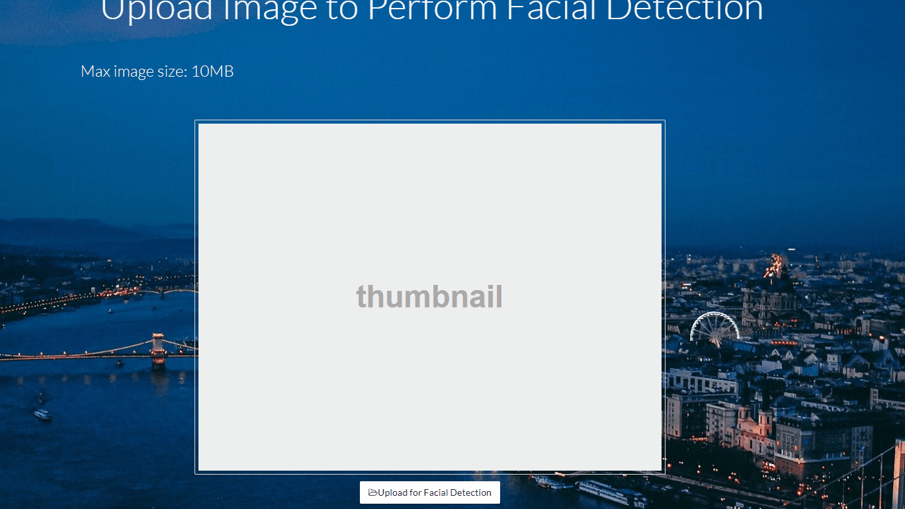

# Facial Decection Web System

*To project marker(TA): The first build time might be as long as **20 minutes** due to the long compiling time for 'dlib' package, which is an essential library for facial landmark detection.I have tried my best and asked the professor for suggestions about resolving this compiling time issue, unfortunately this is the only way so far. Thank you in advance for spending time deploying it. Ports used on localhost are `5555`, `8082` and Vagrant default `2222`, hope this can help you mark other projects while waiting for this project to be compiled.*

## Topic Idea

If we want to perform some advanced/complex image processing on web only using JavaScript, it is really hard. To solve this, the project creates a web system that can perform **facial detection** and **face swapping** from user uploaded images.
For image processing, I implemented it with **Python** since it has large amount of supported libraries. Moreover, it is easy to handle requests concurrently using **Go** at backend.\
I also implemented facial detection using image API from [Pixabay.com](https://pixabay.com/), user can search images by keyword and detect faces on those images.

## Languages

### Front-end

- JavaScript with [Vue](https://vuejs.org/)

### Back-end

- Go
- Python with OpenCV

## Inter-language communication methods

- Command line execution (Go &leftarrow;&rightarrow; Python)
- RPC server (JS &leftarrow;&rightarrow; Go)

## Deployment technology

Vagrant with Ubuntu

## Installation

**Prerequisite:** Vagrant and VirtualBox.
**If you are deploying with Windows, make sure run Vagrant commands as Admin since Windows only allows admin to create symbolic links.**

`Vagrant up`

After successful installation, access `http://localhost:5555/` on web browser to use front-end client.

## Features (with demo)

The system can accept jpeg/jpg/png format image files.

1. Home Page: search images via keywords, you can enlarge them or detect faces on them.

2. Facial Detect Page: upload your own image to perform facial detection. *There are some sample images available to test in `test_imgs` directory under main repository.*

3. Face Swapping Page: upload two images(say image 1 and image 2), an confirmation alert will popup and you can swap image 2's face onto image 1's person. *There are some sample images available to test in `test_imgs` directory under main repository.*

*All Pages can be accessed via top navigation bar.
